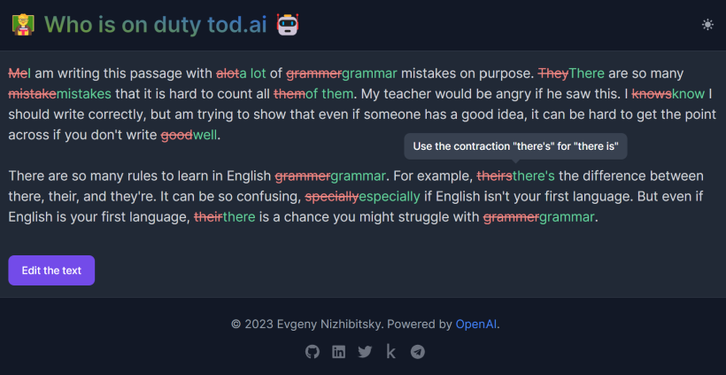

# 🧑‍🏫 Grammar Correction Demo

Making your English a little more Queen's.



The demo is built on top of 🤖 OpenAI ChatGPT[¹](#-credits).

## 🚀 Running

Copy `back/.env.example` to `back/.env` and enter the token from [ChatGPT session](https://chat.openai.com/api/auth/session).

Use docker compose to start backend, frontend and proxy:

```bash
docker compose up --build
```

## 🤗 Credits

- 🤖 [ChatGPT](https://chat.openai.com)
- 🔵 [Solid](https://www.solidjs.com/)
- ⚡ [Vite](https://vitejs.dev/)
- 🎨 [Flowbite](https://flowbite.com/)
- 🖌️ [Tailwind CSS](https://tailwindcss.com/)
- ⚙️ [FastAPI](https://fastapi.tiangolo.com/)
- 🏗️ [Poetry](https://python-poetry.org/)
- 🚦 [Traefik](https://doc.traefik.io/traefik/)
- 🐋 [Docker](https://docs.docker.com)
